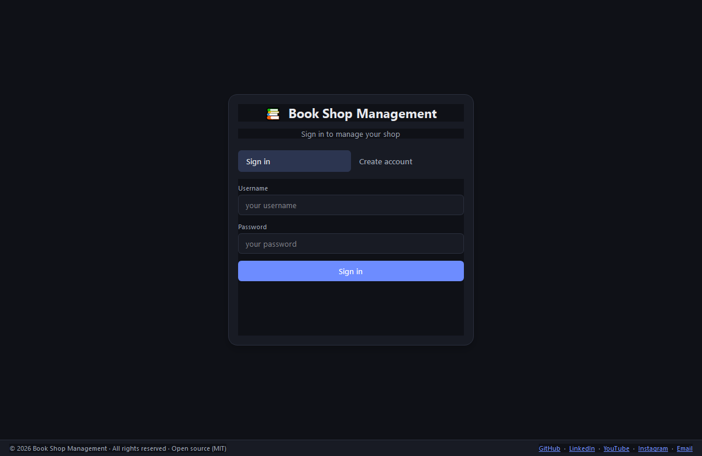
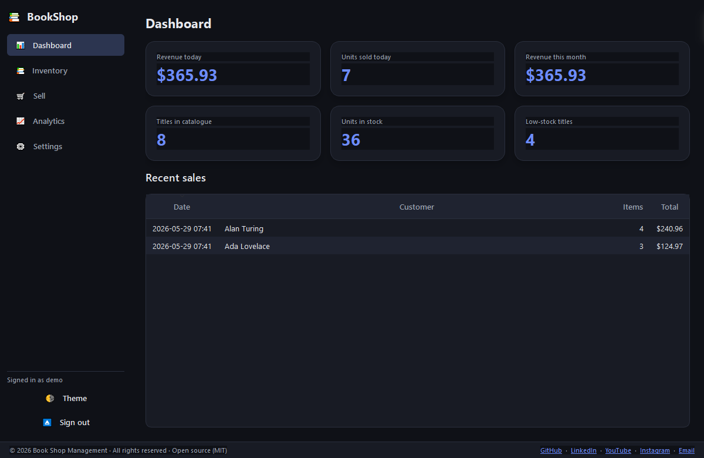
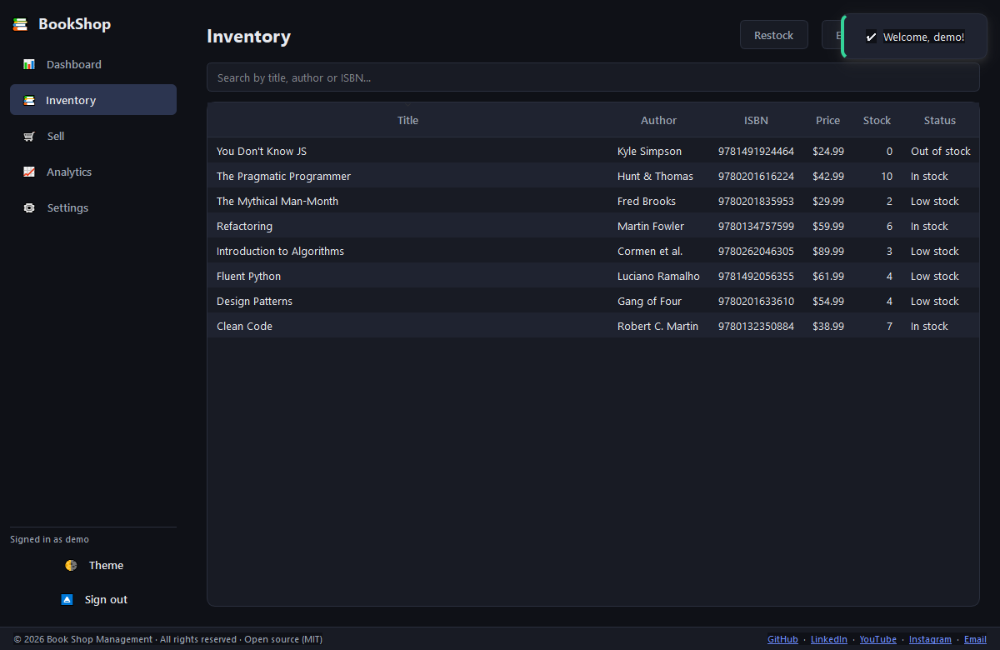
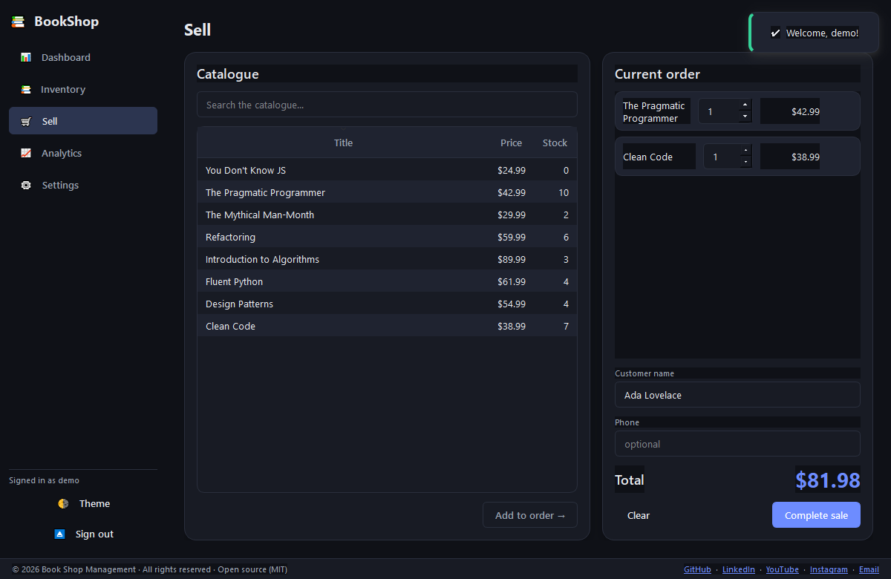
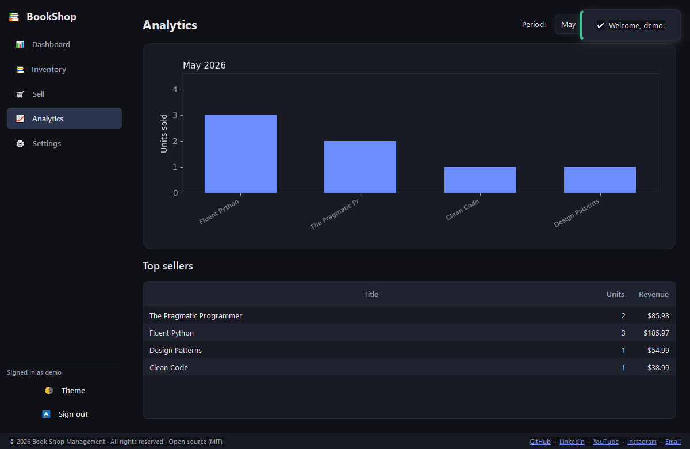
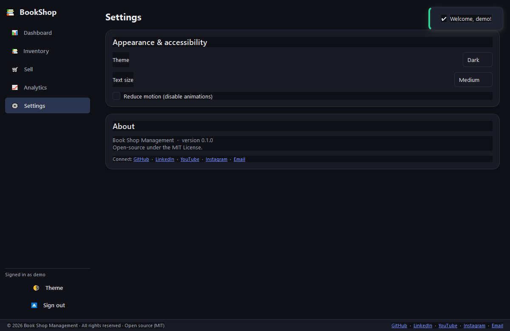

# User manual

A quick guide to using Book Shop Management.

## 1. Sign in / create an account

On first launch you'll see the sign-in screen.

- **Create account:** click **Create account**, choose a username and a password
  (at least 8 characters), confirm it, and submit. You'll be signed in
  automatically.
- **Sign in:** enter your username and password and click **Sign in**.

> Passwords are stored securely (bcrypt-hashed) — they are never kept in plain
> text.

The demo account created by `python -m bookshop seed` is **`demo` / `demo1234`**.

## 2. Dashboard

After signing in you land on the **Dashboard**, which shows at-a-glance KPIs —
revenue today, units sold today, revenue this month, total titles, units in
stock, and how many titles are low on stock — plus a list of recent sales.

## 3. Inventory

Open **Inventory** from the sidebar to manage your books.

- **Search** by title, author, or ISBN using the search box.
- **Sort** by clicking any column header.
- **Add book:** click **＋ Add book**, fill in the title (required), optional
  author/publisher/ISBN, the price, and an initial quantity.
- **Edit:** select a row (or double-click it) and click **Edit**.
- **Restock:** select a row and click **Restock**, then enter how many units to
  add.

The **Status** column flags each title as *In stock*, *Low stock*, or
*Out of stock*.

## 4. Selling books

Open **Sell** to ring up a sale.

1. Find a book in the **Catalogue** (left) and double-click it, or select it and
   click **Add to order →**.
2. Adjust quantities in the **Current order** panel (right). The total updates
   live.
3. Optionally enter the customer's name and phone.
4. Click **Complete sale**.

Stock is decremented atomically — you can never oversell. After completing a
sale, a **receipt** preview opens where you can **Print** or **Save as PDF**.

## 5. Analytics

Open **Analytics** to see monthly sales. Pick a month and year; the chart shows
units sold per title and the **Top sellers** table lists units and revenue.

## 6. Settings

Open **Settings** to personalise the app:

- **Theme:** Dark or Light (also toggle quickly via the sidebar **Theme** button).
- **Text size:** Small / Medium / Large.
- **Reduce motion:** disables animations for accessibility.

## 7. Signing out

Click **Sign out** at the bottom of the sidebar to return to the sign-in screen.

## Troubleshooting

| Symptom | Fix |
|---------|-----|
| "Invalid username or password" | Re-check credentials; create an account if needed. |
| App won't start / Qt error | Ensure dependencies are installed: `pip install -e .`. |
| Want to start fresh | Delete `bookshop.db` (SQLite) and run `python -m bookshop initdb`. |
| Connect to MySQL | Set `DATABASE_URL` and run `alembic upgrade head` (see DEPLOYMENT.md). |
